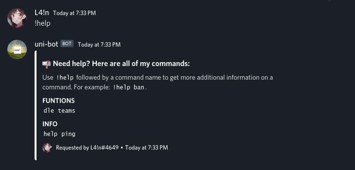

# Uni-bot

a simple bot to remind me uni stuff

## Description

the bot will scrape though the dle and gets available events and also i can view my calender events in teams

## Getting Started

### Installing

* Add your passwords for the dle.js file in commands/funtions/dle.js
* Add token for the Teams in commands/funtions/teams.js
* Add your bot token in config.json

## Help

if you have any issue hmu 
